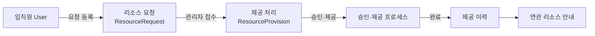
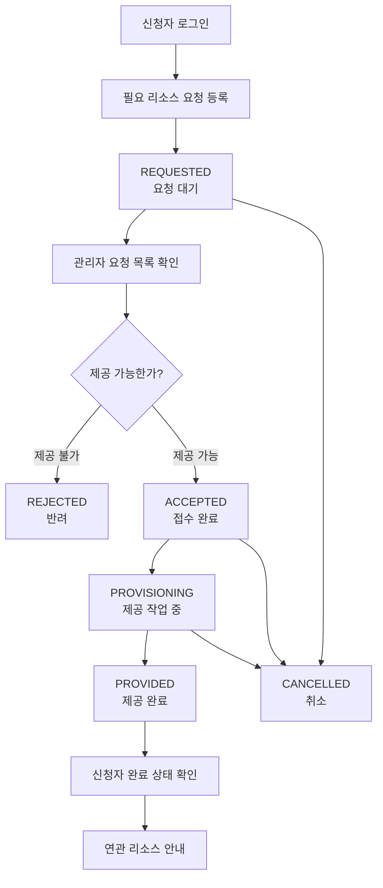
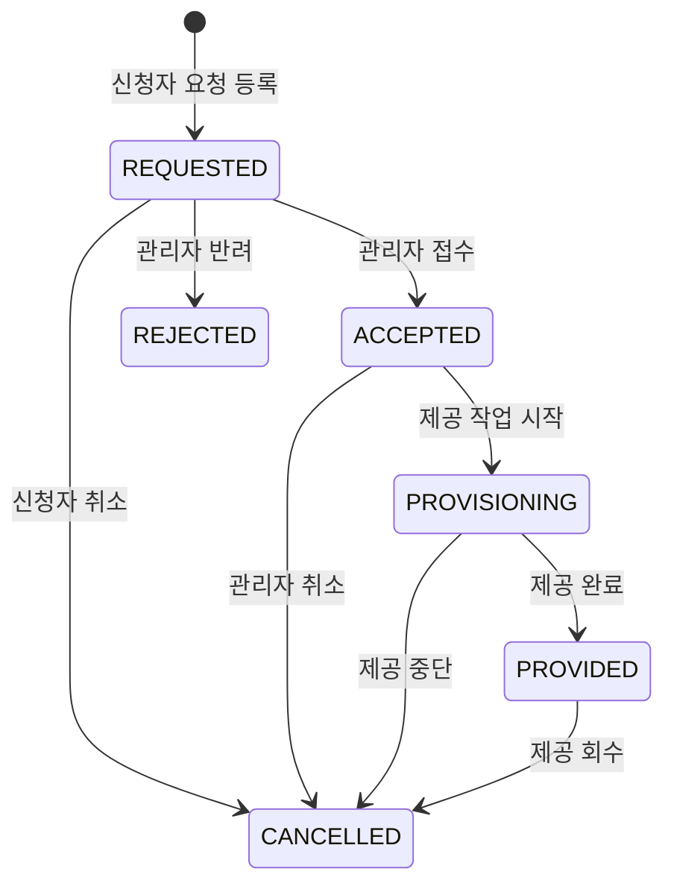
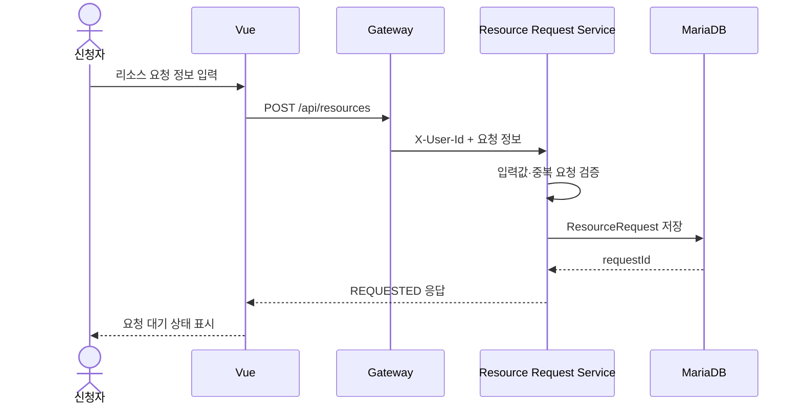
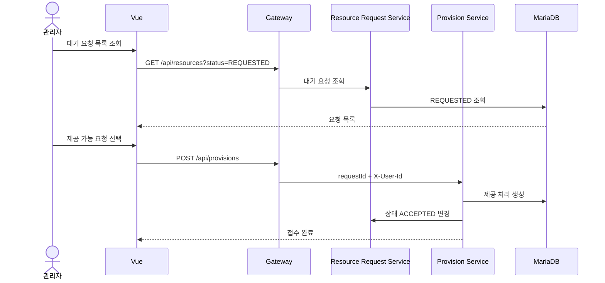
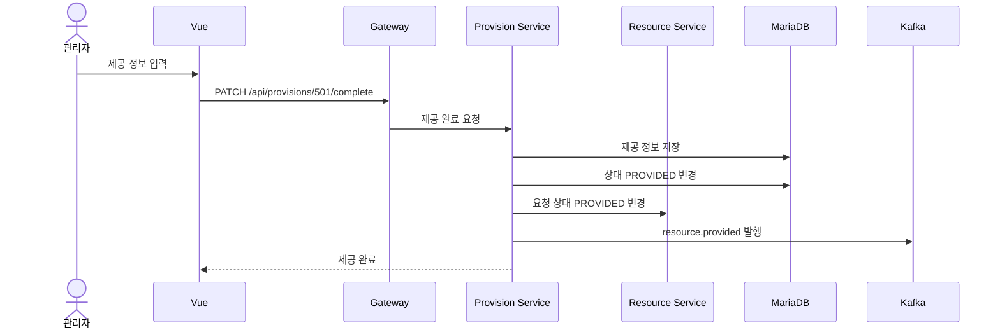
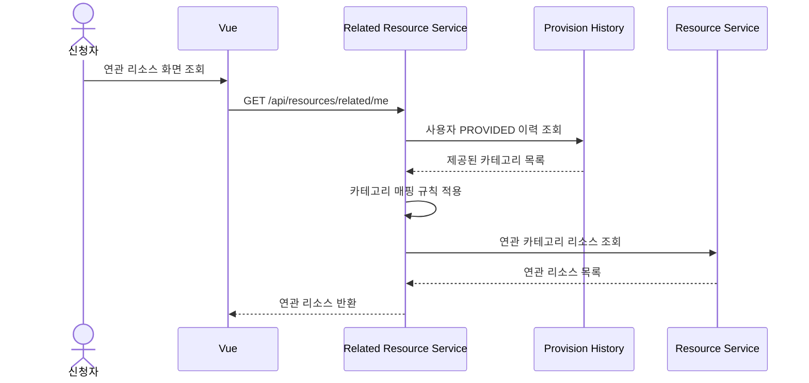
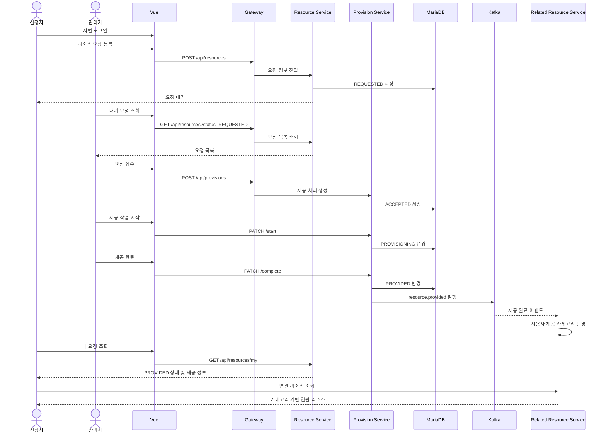

# 사내 IT 리소스 신청·제공 관리 플랫폼

## 0. 서비스 한 줄 정의

> 기업 구성원이 서버, 라이선스, 클라우드 크레딧, 데이터, IT 장비 등의 리소스를 신청하고, 관리자가 요청을 검토·제공하며, 신청·제공·취소 이력을 통합 관리하는 사내 IT 리소스 관리 플랫폼

AI 기능은 제외하고 다음 플로우를 핵심 목표로 한다.

```text
리소스 요청 등록
→ 관리자 검토
→ 제공 작업 시작
→ 제공 완료
→ 신청자 확인
→ 신청·제공 이력 관리
```

---

# 1. 문제 정의

## 1.1 현재 불편함

- 서버, 라이선스, 클라우드 크레딧 등 IT 자원의 신청 현황을 확인하기 어렵다.
- 누가 어떤 리소스를 신청했고 누가 제공했는지 이력이 분산되어 있다.
- 같은 사용자가 동일한 리소스를 중복 신청할 수 있다.
- 데이터 제공 내역과 접근 권한을 개인별로 관리하기 어렵다.
- 관리자가 현재 제공해야 할 요청과 완료한 요청을 구분하기 어렵다.
- 리소스 제공 취소 또는 반려 사유가 기록되지 않는다.
- 이미 제공된 리소스와 추가로 필요한 연관 리소스를 파악하기 어렵다.
- 물리적 장비와 논리적 리소스의 제공 상태를 함께 관리하기 어렵다.

## 1.2 목표

- 리소스 신청자와 제공자를 명확하게 분리한다.
- 요청 생성부터 제공 완료까지 상태를 관리한다.
- 사용자별 신청 이력과 관리자별 제공 이력을 확인할 수 있게 한다.
- 중복 신청을 방지하거나 경고한다.
- 제공·취소·반려 사유를 기록한다.
- 데이터·라이선스 등 보안 리소스 제공 이력을 남긴다.
- 기존 제공 내역을 기준으로 연관 리소스를 안내한다.
- 물리적 장비와 디지털 리소스를 동일한 요청 흐름으로 관리한다.

---

# 2. 이해관계자

| 이해관계자 | 설명 | 얻는 가치 |
|---|---|---|
| 신청자 | 팀 리더, 실무자, 개발자 | 필요한 리소스를 요청하고 처리 상태 확인 |
| 리소스 관리자 | 인프라·클라우드·라이선스·장비 관리자 | 요청 검토, 제공, 반려, 취소 및 이력 관리 |
| 보안 관리자 | 데이터·계정·접근 권한 검토 담당 | 사용자별 데이터 제공 및 보안 이력 확인 |
| 기업 관리자 | 전체 플랫폼 운영 담당 | 조직 전체 신청·제공 현황 통합 관리 |
| 조직 리더 | 팀 리소스 현황 확인 담당 | 조직별 요청 및 제공 상태 확인 |

---

# 3. 사용자 역할

## 3.1 신청자 `REQUESTER`

- 사번 기반 회원가입 및 로그인
- 리소스 요청 등록
- 내 요청 목록·상세 조회
- 요청 처리 상태 확인
- 제공된 접속 정보 또는 자산 정보 확인
- 처리 전 요청 취소
- 취소·반려 사유 확인
- 연관 리소스 목록 조회

## 3.2 리소스 관리자 `RESOURCE_ADMIN`

- 전체 요청 목록 및 상세 조회
- 카테고리·부서·상태별 요청 검색
- 요청 접수
- 제공 작업 시작
- 제공 완료 처리
- 요청 반려
- 제공 취소·회수
- 취소·반려 사유 입력
- 자신이 처리한 제공 내역 조회

## 3.3 시스템 관리자 `SYSTEM_ADMIN`

Sprint 1에서는 `RESOURCE_ADMIN`과 통합해도 된다.

- 사용자 및 역할 관리
- 리소스 카테고리 관리
- 전체 요청·제공 통계
- 보안 리소스 제공 이력 확인
- 관리자별 업무 현황 조회

---

# 4. 현재 프로젝트와의 매핑

## 4.1 도메인 매핑

| 현재 교육 프로젝트 | 변경 후 의미 |
|---|---|
| STUDENT | REQUESTER, 리소스 신청자 |
| INSTRUCTOR | RESOURCE_ADMIN으로 역할 체계 수정 |
| User | 임직원 |
| email | employeeNumber, 사번 |
| Course | ResourceRequest, 리소스 요청 |
| Course.category | ResourceCategory, 리소스 카테고리 |
| Enrollment | ResourceProvision, 리소스 제공 처리 |
| Payment | Approval/Provision Process, 승인·제공 처리 |
| Recommendation | RelatedResource, 연관 리소스 안내 |
| enrollmentCount | provisionCount 또는 requestCount |
| 수강 신청 | 리소스 제공 접수 |
| 수강 완료 | 리소스 제공 완료 |
| 내 수강 목록 | 내 리소스 요청·제공 내역 |
| 내가 등록한 강좌 | 관리자가 처리한 제공 목록 |

## 4.2 중요한 설계 차이

기존 교육 프로젝트:

```text
강사 → 과목 등록
학생 → 과목 선택 → 수강 신청 → 결제 → 수강 확정
```

변경 프로젝트:

```text
신청자 → 필요한 리소스 요청 등록
관리자 → 등록된 요청 검토 → 제공 작업 → 제공 완료
```

따라서 역할 이름만 바꾸는 것으로 끝나지 않는다.

```text
기존 Course 생성자 = 강사
변경 ResourceRequest 생성자 = 신청자
```

기존 `/courses/new`의 접근 권한을 신청자에게 열고 관리자 전용 처리 화면을 별도로 만들어야 한다.

---

# 5. 권장 도메인 구조



## 5.1 `Course` 변경

```text
Course
→ ResourceRequest
→ 신청자가 필요하다고 등록한 리소스 요청서
```

예시:

- AWS 개발 서버 1대
- IntelliJ Ultimate 라이선스
- 고객 데이터 조회 권한
- MacBook Pro
- 클라우드 크레딧 100만 원

## 5.2 `Enrollment` 변경

```text
Enrollment
→ ResourceProvision
→ 관리자와 요청 사이의 제공 처리 관계
```

기록해야 하는 정보:

- 어떤 요청인가?
- 누가 신청했는가?
- 어떤 관리자가 처리했는가?
- 현재 제공 상태는 무엇인가?
- 언제 처리했는가?
- 실제 제공된 리소스 정보는 무엇인가?

---

# 6. 전체 업무 플로우



---

# 7. 상태 정의

| 상태 | 의미 | 변경 주체 |
|---|---|---|
| REQUESTED | 신청자가 요청을 등록한 상태 | 신청자 |
| ACCEPTED | 관리자가 요청을 접수한 상태 | 관리자 |
| PROVISIONING | 관리자가 리소스를 준비하는 상태 | 관리자 |
| PROVIDED | 리소스 제공이 완료된 상태 | 관리자 |
| REJECTED | 제공할 수 없어 반려된 상태 | 관리자 |
| CANCELLED | 신청 또는 제공이 취소된 상태 | 신청자/관리자 |



Sprint 1 최소 상태:

```text
REQUESTED
PROVISIONING
PROVIDED
```

권장 Enum:

```java
public enum Status {
    REQUESTED,
    ACCEPTED,
    PROVISIONING,
    PROVIDED,
    REJECTED,
    CANCELLED
}
```

---

# 8. 로그인 및 회원가입 매핑

## 기존

```text
email
password
name
role: STUDENT / INSTRUCTOR
```

## 변경

```text
employeeNumber
password
name
department
role: REQUESTER / RESOURCE_ADMIN
```

```json
{
  "employeeNumber": "E20260001",
  "password": "password123",
  "name": "이진형",
  "department": "플랫폼개발팀",
  "role": "REQUESTER"
}
```

Auth Server 소스가 저장소에 없으므로 Sprint 1에서는 다음 방식을 권장한다.

```text
화면 입력: E20260001
내부 OAuth ID: E20260001@company.local
```

사용자에게는 사번만 보여주고 기존 이메일 기반 인증 구조는 유지한다.

---

# 9. 리소스 카테고리

```text
SERVER
CLOUD
LICENSE
DATA
ACCOUNT
NETWORK
DATABASE
PHYSICAL_DEVICE
ETC
```

| 코드 | 설명 | 예시 |
|---|---|---|
| SERVER | 서버·VM | Linux VM, 개발 서버 |
| CLOUD | 클라우드 자원 | AWS 크레딧, S3, Kubernetes |
| LICENSE | 소프트웨어 라이선스 | IntelliJ, Figma, Adobe |
| DATA | 데이터·데이터셋 | 고객 데이터, 로그 데이터 |
| ACCOUNT | 서비스 계정 | GitHub, Jira, VPN |
| NETWORK | 네트워크 권한 | 방화벽, IP, VPN |
| DATABASE | DB 및 접근 권한 | 스키마, 계정, 읽기 권한 |
| PHYSICAL_DEVICE | 물리 장비 | 노트북, 모니터, 키보드 |
| ETC | 기타 | 분류되지 않은 요청 |

선택 보안 등급:

```text
PUBLIC
INTERNAL
CONFIDENTIAL
RESTRICTED
```

---

# 10. 시나리오 1: 리소스 요청 등록



입력 항목:

- 리소스명
- 설명
- 카테고리
- 수량
- 사용 목적
- 희망 제공일
- 사용 기간
- 보안 등급

```http
POST /api/resources
Authorization: Bearer <access-token>
Content-Type: application/json
```

```json
{
  "name": "AWS 개발 서버",
  "description": "신규 결제 서비스 개발 및 테스트 용도",
  "category": "SERVER",
  "quantity": 1,
  "purpose": "결제 서비스 개발",
  "desiredDate": "2026-08-20",
  "usagePeriodDays": 90,
  "securityLevel": "INTERNAL"
}
```

---

# 11. 시나리오 2: 관리자 요청 접수



```http
POST /api/provisions
Authorization: Bearer <admin-token>
```

```json
{
  "requestId": 101
}
```

---

# 12. 시나리오 3: 제공 작업 시작

페이지를 벗어났다고 상태를 자동 변경하지 않는다. 반드시 관리자 버튼으로 변경한다.

```text
[요청 접수]
[제공 작업 시작]
[제공 완료]
[반려]
[취소]
```

```http
PATCH /api/provisions/{provisionId}/start
```

```json
{
  "provisionId": 501,
  "requestId": 101,
  "status": "PROVISIONING",
  "managerId": 20
}
```

---

# 13. 시나리오 4: 리소스 제공 완료



제공 완료 정보 예시:

```json
{
  "resourceIdentifier": "aws-vm-dev-001",
  "accessInformation": "10.20.30.40",
  "expiresAt": "2026-11-20",
  "managerMemo": "개발 환경 전용 서버"
}
```

리소스별 추가 정보:

| 리소스 | 제공 정보 |
|---|---|
| 서버 | 서버 ID, 주소, OS, CPU/메모리, 만료일 |
| 라이선스 | 라이선스명, 키/계정, 유효기간, 수량 |
| 클라우드 | 공급자, 프로젝트 ID, 금액, 만료일 |
| 데이터 | 데이터셋명, 접근 방법, 권한, 보안 등급 |
| 장비 | 자산번호, 모델명, 시리얼번호, 반납일 |

---

# 14. 반려 및 취소

## 관리자 반려

```http
PATCH /api/resources/{requestId}/reject
```

```json
{
  "reason": "동일 목적의 개발 서버가 이미 제공되어 있습니다."
}
```

## 신청자 취소

허용 상태: `REQUESTED`

```http
PATCH /api/resources/{requestId}/cancel
```

## 관리자 제공 취소·회수

허용 상태:

```text
ACCEPTED
PROVISIONING
PROVIDED
```

```http
PATCH /api/provisions/{provisionId}/cancel
```

저장 정보:

```text
cancelledBy
cancelledAt
cancelReason
previousStatus
```

---

# 15. 중요 Kafka 이벤트

AI는 제외하지만 Kafka 이벤트는 유지한다.

## `resource.requested`

```json
{
  "requestId": 101,
  "requesterId": 10,
  "category": "SERVER",
  "status": "REQUESTED"
}
```

## `provision.started`

```json
{
  "provisionId": 501,
  "requestId": 101,
  "managerId": 20,
  "status": "PROVISIONING"
}
```

## `resource.provided`

가장 중요한 이벤트다.

```text
기존 enrollment.completed
→ resource.provided
```

```json
{
  "provisionId": 501,
  "requestId": 101,
  "requesterId": 10,
  "managerId": 20,
  "category": "SERVER",
  "resourceIdentifier": "aws-vm-dev-001",
  "status": "PROVIDED",
  "providedAt": "2026-08-10T15:00:00"
}
```

소비 후 처리:

- 사용자 제공 이력 반영
- 관리자 처리 실적 반영
- 연관 리소스 후보 갱신
- 제공 완료 알림
- 보안 감사 로그 생성

## `resource.cancelled`

```json
{
  "requestId": 101,
  "provisionId": 501,
  "cancelledBy": 20,
  "previousStatus": "PROVIDED",
  "reason": "보안 정책 위반으로 권한 회수",
  "cancelledAt": "2026-08-15T10:00:00"
}
```

Sprint 1 최소 이벤트:

```text
resource.provided
```

Sprint 2 권장 이벤트:

```text
resource.provided
resource.cancelled
```

---

# 16. 연관 리소스 안내

AI 추천이 아닌 규칙 기반 기능이다.

> 사용자에게 이미 제공된 리소스의 카테고리를 기준으로 같은 카테고리 또는 사전에 연결된 연관 리소스를 보여준다.

| 제공된 리소스 | 연관 리소스 |
|---|---|
| 개발 서버 | VPN 계정, DB 접근 권한, 모니터링 권한 |
| AWS 크레딧 | AWS 계정, 비용 알림, S3 접근 권한 |
| IntelliJ 라이선스 | GitHub 계정, JetBrains 플러그인 |
| 고객 데이터 | 데이터 사전, 분석 DB, 보안 교육 |
| 노트북 | 모니터, 키보드, 보안 프로그램 |
| Kubernetes Namespace | Registry 권한, 배포 계정, 로그 권한 |

카테고리 규칙:

```text
SERVER → NETWORK, DATABASE, ACCOUNT
CLOUD → ACCOUNT, NETWORK, DATABASE
DATA → DATABASE, ACCOUNT
PHYSICAL_DEVICE → LICENSE, ACCOUNT
LICENSE → ACCOUNT
```



---

# 17. 화면 정의

## 신청자 화면

- 신청자 대시보드
- 리소스 요청 등록
- 내 요청 목록
- 요청 상세
- 제공 정보 확인
- 취소·반려 사유 확인
- 연관 리소스

신청자 대시보드:

```text
요청 대기 수
접수된 요청 수
제공 작업 중 수
제공 완료 수
최근 요청
연관 리소스
```

## 관리자 화면

- 대기 요청 목록
- 요청 상세
- 요청 접수
- 제공 작업 시작
- 제공 완료
- 반려 및 취소
- 내가 처리한 제공 목록

관리자 버튼:

```text
[요청 접수]
[제공 작업 시작]
[제공 완료]
[반려]
[취소]
```

---

# 18. API 설계

## User API

| Method | API | 설명 | 권한 |
|---|---|---|---|
| POST | `/api/users/register` | 사번 기반 회원가입 | 공개 |
| GET | `/api/users/me` | 로그인 사용자 조회 | 공통 |
| GET | `/api/users/{id}` | 사용자 조회 | 관리자 |
| GET | `/api/users/internal/{id}` | 내부 사용자 조회 | 서비스 |

## Resource Request API

| Method | API | 설명 | 권한 |
|---|---|---|---|
| POST | `/api/resources` | 리소스 요청 등록 | REQUESTER |
| GET | `/api/resources` | 전체 요청 조회 | ADMIN |
| GET | `/api/resources/my` | 내 요청 목록 | REQUESTER |
| GET | `/api/resources/{id}` | 요청 상세 | 공통 |
| GET | `/api/resources/category/{category}` | 카테고리별 요청 | ADMIN |
| PATCH | `/api/resources/{id}/cancel` | 신청자 요청 취소 | REQUESTER |
| PATCH | `/api/resources/{id}/reject` | 관리자 반려 | ADMIN |

## Provision API

| Method | API | 설명 | 권한 |
|---|---|---|---|
| POST | `/api/provisions` | 관리자 요청 접수 | ADMIN |
| GET | `/api/provisions/my` | 내가 처리한 제공 목록 | ADMIN |
| GET | `/api/provisions/{id}` | 제공 상세 | 공통 |
| PATCH | `/api/provisions/{id}/start` | 제공 작업 시작 | ADMIN |
| PATCH | `/api/provisions/{id}/complete` | 제공 완료 | ADMIN |
| PATCH | `/api/provisions/{id}/cancel` | 제공 취소·회수 | ADMIN |
| GET | `/api/provisions/user/{userId}` | 사용자 제공 이력 | ADMIN |

## Related Resource API

| Method | API | 설명 | 권한 |
|---|---|---|---|
| GET | `/api/resources/related/me` | 내 연관 리소스 | REQUESTER |
| GET | `/api/resources/related/{userId}` | 사용자 연관 리소스 | ADMIN |

---

# 19. 데이터 모델

## User

```text
id
employeeNumber
password
name
department
role
createdAt
updatedAt
```

## ResourceRequest

```text
id
requesterId
name
description
category
quantity
purpose
desiredDate
usagePeriodDays
securityLevel
status
rejectionReason
cancellationReason
createdAt
updatedAt
```

## ResourceProvision

```text
id
requestId
requesterId
managerId
status
resourceIdentifier
accessInformation
managerMemo
expiresAt
cancelReason
acceptedAt
startedAt
providedAt
cancelledAt
createdAt
updatedAt
```

## StatusHistory

Sprint 2 권장 테이블:

```text
id
requestId
provisionId
previousStatus
newStatus
changedBy
reason
changedAt
```

---

# 20. 중복 요청 방지

중복 판단 후보:

```text
requesterId
category
resourceName
status IN (REQUESTED, ACCEPTED, PROVISIONING, PROVIDED)
```

동일 리소스를 여러 개 신청할 수 있으므로 무조건 차단하지 않는다.

권장 방식:

```text
중복 요청 발견
→ 기존 요청 정보 경고
→ 신청자가 기존 요청 확인
→ 추가 요청이 필요하면 사유 입력 후 계속
```

---

# 21. 권한 규칙

| 기능 | REQUESTER | RESOURCE_ADMIN |
|---|---:|---:|
| 리소스 요청 등록 | 가능 | 가능 |
| 내 요청 조회 | 가능 | 가능 |
| 전체 요청 조회 | 불가 | 가능 |
| 요청 접수 | 불가 | 가능 |
| 제공 작업 시작 | 불가 | 가능 |
| 제공 완료 | 불가 | 가능 |
| 요청 반려 | 불가 | 가능 |
| 처리 전 요청 취소 | 가능 | 가능 |
| 제공 후 회수 | 불가 | 가능 |
| 제공 이력 조회 | 본인만 | 전체 가능 |

프론트 라우터뿐만 아니라 Gateway 또는 서비스에서도 권한을 검증해야 한다.

---

# 22. Sprint 1

## 목표

> 신청자가 리소스를 요청하고 관리자가 제공 완료 처리한 뒤 신청자가 완료 상태를 확인할 수 있게 한다.

## 구현 범위

### 역할·인증

- `STUDENT → REQUESTER`
- `INSTRUCTOR → RESOURCE_ADMIN`
- 이메일 입력 화면을 사번 입력 형태로 변경
- 역할별 메뉴 분리

### 리소스 요청

- 과목 등록 화면을 리소스 요청 등록 화면으로 변경
- Course 필드를 ResourceRequest에 맞게 수정
- 리소스 카테고리 변경
- 신청자별 요청 목록 제공

### 관리자 처리

- 대기 요청 목록
- 요청 상세
- 요청 접수
- 제공 작업 시작
- 제공 완료

### 최소 상태

```text
REQUESTED
PROVISIONING
PROVIDED
```

### 완료 시나리오

```text
신청자 로그인
→ 리소스 요청 등록
→ 관리자 로그인
→ 요청 목록 확인
→ 제공 작업 시작
→ 제공 완료
→ 신청자 로그인
→ PROVIDED 상태 확인
```

---

# 23. Sprint 2

## 취소·반려

- 신청자 요청 취소
- 관리자 요청 반려
- 관리자 제공 취소·회수
- 취소·반려 사유 기록

## 상태 확장

```text
REQUESTED
ACCEPTED
PROVISIONING
PROVIDED
REJECTED
CANCELLED
```

## 이력

- 상태 변경 이력
- 관리자별 제공 목록
- 사용자별 제공 이력
- 데이터·계정 제공 이력

## Kafka

```text
resource.provided
resource.cancelled
```

## 연관 리소스

- 제공 완료 카테고리 조회
- 카테고리별 연관 규칙 적용
- 이미 제공된 리소스 제외
- 연관 리소스 표시

---

# 24. 기능 우선순위

## 필수

```text
로그인
역할별 화면
리소스 요청 등록
요청 대기 목록
관리자 접수
제공 작업 시작
제공 완료
내 요청 내역
관리자 제공 내역
```

## Sprint 2

```text
취소
반려
사유 입력
상태 변경 이력
연관 리소스 안내
Kafka 이벤트명 변경
```

## 후순위

```text
리소스 부하 모니터링
미래 사용량 예측
원인 분석
위험 알림
자동 자원 할당
실제 클라우드 API 연동
실제 라이선스 시스템 연동
```

AI 기능은 현재 프로젝트 범위에서 제외한다.

---

# 25. 핵심 사용자 시나리오

## 신청자

```text
1. 신청자가 사번으로 로그인한다.
2. 필요한 리소스 요청서를 작성한다.
3. 요청은 REQUESTED 상태로 저장된다.
4. 신청자는 내 요청 목록에서 상태를 확인한다.
5. 관리자가 작업을 시작하면 PROVISIONING 상태가 표시된다.
6. 제공이 완료되면 PROVIDED 상태가 표시된다.
7. 신청자는 접속 정보 또는 자산 정보를 확인한다.
8. 제공 카테고리를 기준으로 연관 리소스를 확인한다.
```

## 관리자

```text
1. 관리자가 로그인한다.
2. REQUESTED 요청을 조회한다.
3. 요청자의 부서·사용 목적·카테고리를 확인한다.
4. 제공 가능한 요청을 접수한다.
5. 리소스 제공 작업을 시작한다.
6. 서버·계정·장비 등의 제공 정보를 입력한다.
7. 제공 완료 버튼을 누른다.
8. 상태가 PROVIDED로 변경된다.
9. resource.provided 이벤트가 발행된다.
10. 관리자는 내가 처리한 제공 목록에서 이력을 확인한다.
```

---

# 26. 최종 서비스 플로우



---

# 27. 발표용 한 문장

> 기존에는 사내 IT 리소스 신청과 제공 이력이 여러 채널에 흩어져 처리 상태와 보안 이력을 확인하기 어려웠습니다. 이를 해결하기 위해 신청자와 제공자를 분리하고, 요청부터 제공 완료·취소까지 전 과정을 상태와 이벤트로 관리하는 사내 IT 리소스 신청·제공 플랫폼을 구현합니다.

---

# 28. 핵심 차별점

```text
신청자와 제공자의 명확한 분리
리소스 요청 상태의 단계별 관리
사용자별·관리자별 제공 이력
데이터 및 계정 제공의 보안 이력
물리 장비와 디지털 리소스 통합 관리
Kafka 기반 제공 완료 이벤트
규칙 기반 연관 리소스 안내
```

---

# 29. 팀에서 결정할 사항

1. 역할 이름을 `REQUESTER`, `RESOURCE_ADMIN`으로 실제 변경할 것인가?
2. Auth Server 제약 때문에 사번을 내부 이메일 형태로 사용할 것인가?
3. `ResourceRequest`가 `Course` 테이블을 완전히 대체하는가?
4. `ResourceProvision`을 `Enrollment`로 구현할 것인가?
5. Payment Service를 Provision/Approval 용도로 수정할 것인가?
6. Sprint 1의 상태를 세 개로 제한할 것인가?
7. 제공 완료 정보를 Request와 Provision 중 어디에 저장할 것인가?
8. 물리 장비 자산번호를 Sprint 1에 포함할 것인가?
9. Kafka 이벤트명을 Sprint 1에서 변경할 것인가?
10. 연관 리소스를 요청 데이터에서 찾을지 별도 카탈로그를 만들지 결정해야 한다.

---

# 30. 권장 Sprint 1 구조

```text
User
→ employeeNumber, department, role

Course Service
→ Resource Request Service

Enrollment Service
→ Resource Provision Service

Payment Service
→ 제공 승인 역할로 유지하거나 Sprint 1에서 최소화

Recommend Service
→ Sprint 2 규칙 기반 연관 리소스 안내

상태
→ REQUESTED, PROVISIONING, PROVIDED
```
